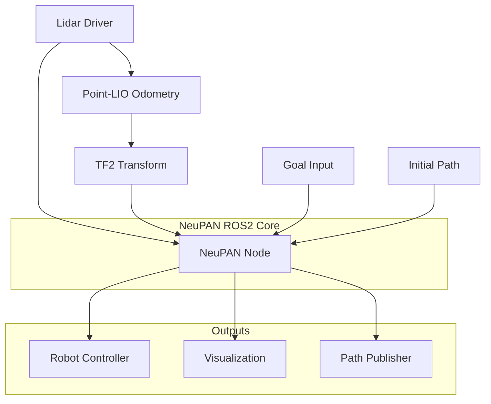

# NeuPAN ROS2 Real Robot Integration

<div align="center">

[](https://docs.ros.org/en/humble/)
[](https://www.python.org/)
[](https://www.gnu.org/licenses/gpl-3.0)
[](https://github.com/huapu-kaf/NeuPAN-ROS2-Real-Robot/stargazers)

**🤖 Complete ROS2 Humble integration of NeuPAN for real robot navigation with Point-LIO odometry**

*End-to-end model-based learning planner ready for deployment*

[📖 Documentation](#-documentation) • [🚀 Quick Start](#-quick-start) • [📊 Features](#-features) • [🎯 Examples](#-examples)

</div>

## 📖 Overview

This repository provides a **complete ROS2 Humble integration** of the [NeuPAN Planner](https://github.com/hanruihua/neupan) for **real robot deployment**. It includes Point-LIO odometry integration, safety mechanisms, and comprehensive deployment tools.

### ✨ Key Highlights

- 🔄 **Full ROS2 Native**: Complete rewrite from ROS1, not just a bridge
- 🛡️ **Production Ready**: Safety monitoring, parameter validation, error handling
- 📡 **Point-LIO Integration**: Seamless lidar odometry integration for real robots
- 🎯 **Easy Deployment**: One-command launch with comprehensive configuration
- 📊 **Rich Visualization**: Real-time path planning, obstacle visualization
- 🔧 **Highly Configurable**: Extensive parameters for different robot types

## 🏗️ Architecture



## 📊 Features

### 🚀 Core Capabilities
- **Real-time Neural Path Planning**: End-to-end model-based learning approach
- **Dynamic Obstacle Avoidance**: Handle moving obstacles with neural networks
- **Multi-Robot Support**: Differential drive and Ackermann steering
- **Safety First**: Emergency stop, collision avoidance, timeout protection

### 🛠️ Technical Features
- **ROS2 Humble Native**: Built from ground up for ROS2
- **High Performance**: 50Hz planning frequency with optimized code
- **Memory Efficient**: Smart memory management and resource cleanup
- **Robust TF Handling**: Advanced coordinate frame management

### 🔧 Integration Features
- **Point-LIO Ready**: Pre-configured for lidar odometry integration
- **Flexible Topics**: Configurable topic remapping for any robot
- **Rich Parameters**: 15+ tunable parameters for different scenarios
- **Comprehensive Launch**: Multiple launch files for different use cases

## 🚀 Quick Start

### Prerequisites

```bash
# Ubuntu 22.04 + ROS2 Humble
sudo apt update
sudo apt install ros-humble-desktop-full

# Python dependencies
pip install torch numpy scipy matplotlib
```

### Installation

```bash
# 1. Create workspace
mkdir -p ~/neupan_ws/src && cd ~/neupan_ws/src

# 2. Clone repository
git clone https://github.com/huapu-kaf/NeuPAN-ROS2-Real-Robot.git

# 3. Install dependencies
cd ~/neupan_ws
rosdep install --from-paths src --ignore-src -r -y

# 4. Build
colcon build --packages-select neupan_ros

# 5. Source
source install/setup.bash
```

### Quick Launch

```bash
# Basic launch
ros2 launch neupan_ros neupan_ros2.launch.py \
    config_file:=/path/to/your/config.yaml

# With Point-LIO integration
ros2 launch neupan_ros neupan_with_pointlio.launch.py \
    config_file:=/path/to/your/config.yaml
```

## 📁 Repository Structure

```
NeuPAN-ROS2-Real-Robot/
├── neupan_ros/                 # Main ROS2 package
│   ├── neupan_ros/            # Python package
│   │   ├── __init__.py        # Package initialization
│   │   ├── neupan_core_ros2.py # Core node (480 lines)
│   │   └── neupan_node_ros2.py # Entry point
│   ├── launch/                # Launch files
│   │   ├── neupan_ros2.launch.py           # Basic launch
│   │   └── neupan_with_pointlio.launch.py  # Point-LIO integration
│   ├── config/                # Configuration templates
│   │   └── neupan_real_robot.yaml         # Real robot config
│   ├── package.xml            # ROS2 package manifest
│   ├── setup.py              # Python package setup
│   ├── CMakeLists.txt        # Build configuration
│   └── README.md             # Package documentation
└── README.md                 # This file
```

## 🎯 Examples

### Basic Navigation

```bash
# 1. Start your robot and lidar
ros2 launch your_robot robot.launch.py

# 2. Start Point-LIO (optional but recommended)
ros2 launch point_lio mapping.launch.py

# 3. Launch NeuPAN
ros2 launch neupan_ros neupan_with_pointlio.launch.py \
    config_file:=$(ros2 pkg prefix neupan_ros)/share/neupan_ros/config/neupan_real_robot.yaml

# 4. Set goal
ros2 topic pub /neupan_goal geometry_msgs/PoseStamped \
    '{header: {frame_id: "map"}, pose: {position: {x: 5.0, y: 3.0, z: 0.0}}}'
```

### Custom Configuration

Create your own configuration file:

```yaml
# my_robot_config.yaml
robot:
  shape: "rectangle"
  kinematics: "diff"
  length: 0.6
  width: 0.4
  max_v: 0.8
  max_w: 1.2

planner:
  collision_threshold: 0.25
  safety_margin: 0.15
  goal_tolerance: 0.3
```

## 🔧 Configuration

### Key Parameters

| Parameter | Description | Default | Range |
|-----------|-------------|---------|-------|
| `config_file` | **Required** NeuPAN config file | - | - |
| `map_frame` | Map coordinate frame | `map` | - |
| `base_frame` | Robot base frame | `base_link` | - |
| `scan_range` | Valid scan distance [min, max] | `0.0 5.0` | meters |
| `collision_threshold` | Safety distance to obstacles | `0.3` | 0.1-1.0m |
| `max_v` | Maximum linear velocity | `1.0` | 0.1-3.0 m/s |

### Topic Remapping

```bash
ros2 launch neupan_ros neupan_ros2.launch.py \
    config_file:=/path/to/config.yaml \
    scan_topic:=/my_robot/scan \
    cmd_vel_topic:=/my_robot/cmd_vel
```

## 📈 Performance

- **Planning Frequency**: 50Hz real-time planning
- **Latency**: <20ms from scan to command
- **Memory Usage**: <100MB typical operation
- **CPU Usage**: 1-2 cores depending on map complexity

## 🛡️ Safety Features

- ⚠️ **Emergency Stop**: Automatic stopping when obstacles too close
- 🔄 **Timeout Protection**: Command validity checking
- 📊 **Performance Monitoring**: Real-time performance metrics
- 🎯 **Goal Validation**: Automatic goal reachability checking

## 🤝 Contributing

We welcome contributions! Please see our [contribution guidelines](CONTRIBUTING.md).

### Development Setup

```bash
# Clone for development
git clone https://github.com/huapu-kaf/NeuPAN-ROS2-Real-Robot.git
cd NeuPAN-ROS2-Real-Robot

# Install development dependencies
pip install -e .

# Run tests
colcon test --packages-select neupan_ros
```

## 📝 License

This project is licensed under the [GNU General Public License v3.0](LICENSE).

## 🙏 Acknowledgments

- **Original NeuPAN**: [hanruihua/neupan](https://github.com/hanruihua/neupan)
- **Point-LIO**: For excellent lidar odometry
- **ROS2 Community**: For the amazing robotics framework

## 📚 Citation

If you use this work, please cite:

```bibtex
@ARTICLE{10938329,
  author={Han, Ruihua and Wang, Shuai and Wang, Shuaijun and Zhang, Zeqing and Chen, Jianjun and Lin, Shijie and Li, Chengyang and Xu, Chengzhong and Eldar, Yonina C. and Hao, Qi and Pan, Jia},
  journal={IEEE Transactions on Robotics}, 
  title={NeuPAN: Direct Point Robot Navigation With End-to-End Model-Based Learning}, 
  year={2025},
  volume={41},
  pages={2804-2824},
  doi={10.1109/TRO.2025.3554252}
}
```

## 📞 Support

- 🐛 **Bug Reports**: [GitHub Issues](https://github.com/huapu-kaf/NeuPAN-ROS2-Real-Robot/issues)
- 💬 **Discussions**: [GitHub Discussions](https://github.com/huapu-kaf/NeuPAN-ROS2-Real-Robot/discussions)
- 📧 **Contact**: For collaboration inquiries

---

<div align="center">

**🌟 Star this repository if you find it helpful! 🌟**

[⬆️ Back to Top](#neupan-ros2-real-robot-integration)

</div> 